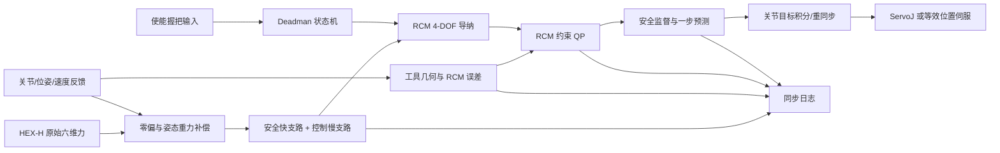

# 带使能握把的 RCM / 软 RCM 内窥镜导纳拖动控制方案

> 项目：ScopeGuide\
> 目标平台：六轴机械臂 + 六维力传感器 + 硬质鼻腔内窥镜\
> 文档性质：研究原型设计方案，不是临床可用或医疗器械安全论证\
> 参考代码：`drag_teaching_main.m`（仅参考其接口、补偿链路和诊断思路，不沿用其控制器结构）

## 1. 结论与推荐架构

本项目建议采用以下控制结构：

1. 把内窥镜运动显式定义为 RCM 下的 4 个自由度：
   - 绕 RCM 的两个枢转自由度（pitch / yaw）；
   - 沿镜杆轴线的插入/退出；
   - 绕镜杆轴线的滚转。
2. 在这 4 个广义自由度上实现带虚拟质量的导纳，而不是直接使用
   `V = F / D` 的纯阻尼映射。
3. 使用 RCM 原生运动基生成期望 twist，再通过带关节边界、加速度边界和
   RCM 约束的 QP 求解关节速度。
4. 正常操作采用软 RCM，使鼻腔入口附近保留小范围顺应性；在软走廊之外增加
   高增益恢复，并用独立的硬边界、预测检查和故障停机保证约束不会无限漂移。
5. 使能握把作为 deadman：只有信号有效且全部安全门通过时才允许运动；松手下降沿
   必须立即使速度参考归零并把累计关节目标重新锚定到延迟补偿后的当前位置。

不建议采用“任意 6D 导纳速度 → 普通雅可比伪逆 → 事后检查 RCM”的结构。
该结构会让用户输入、冗余运动和 RCM 修正互相竞争，并且很难解释鼻腔入口处实际
发生的运动。

## 2. 任务边界

### 2.1 要实现的功能

- 操作者握住末端握把，以小力调整硬质鼻内窥镜视野；
- 按住使能握把时允许微动，松开时停止；
- 支持硬 RCM、软 RCM 和“软约束 + 硬安全包络”的混合模式；
- 支持枢转、微量插入和后续可选的滚转；
- 对力传感器超时、机械臂状态超时、RCM 漂移、关节限位、奇异位形、控制超周期
  和握把信号丢失进行故障处理；
- 保存足够的控制日志，使每次微动能离线复现和解释。

### 2.2 暂不包含

- 自动视觉导航或图像空间闭环；
- 病人/头部运动跟踪；
- 动态软组织模型；
- 临床接触力安全阈值结论；
- 医疗器械法规合规性声明。

第一版应在固定头模、鼻腔 phantom 或带孔机械夹具上完成验证，不能直接用于人体。

## 3. 已知事实、假设与待标定量

### 3.1 当前已有事实

| 项目 | 当前状态 |
|---|---|
| 力传感器 | OnRobot HEX-H，已有 Matlab Modbus TCP 客户端 |
| 静态负载补偿 | 已标定质量、质心、六维零偏和重力符号 |
| 当前采用标定 | `force_calibration/data/hex_h_tool_calibration_20260807_164630/calibration_without_pose09.json` |
| 工具质量 | `1.222368209 kg`（传感器之后的被标定负载） |
| 传感器到工具轴旋转 | `diag([-1,-1,1])` |
| 静态补偿验证 | 九姿态留一力/力矩 RMSE 为 `0.2621 N / 0.0570 N·m`；7200 点回放最大慢速残余合力 `1.177 N`；多姿态实时复核待完成 |
| 静态补偿局限 | 未包含运动惯性、线缆力和温漂补偿 |
| 旋转控制局限 | 传感器原点到工具控制点的平移尚未标定，补偿后力矩仍关于传感器原点 |
| 法兰到内窥镜参考系 | 已给定 `T_flange_endoscope`，参考系原点为物理尖端 |
| 镜杆轴线 | 与内窥镜参考系 `+Z` 同向 |
| 机器人接口 | 后续控制以 `robot/ZJFDobotCR5.m` 为接口基础 |
| 机器人名义运动学 | 已给定标准 DH 参数和关节零位偏置 |

因此，`drag_teaching_main.m` 中的 `0.3 N` 合力死区不适合直接作为本项目默认值；
它低于当前跨姿态静态残余水平，可能导致无意漂移。

### 3.2 标定状态与仍缺数据

#### 3.2.1 已补齐：工具参考系、尖端和镜杆轴线

法兰到内窥镜参考坐标系的变换已经给定：

```matlab
robotCfg.ToolTransform = [
    1 0 0 -0.002840;
    0 1 0  0.113051;
    0 0 1  0.355046;
    0 0 0  1
];
```

本方案把它解释为 `T_flange_endoscope`，并统一使用下式：

$$
T_B^E = T_B^F T_F^E
$$

由此得到：

- 内窥镜参考系与法兰坐标轴平行；
- 内窥镜物理尖端就是 `{E}` 原点，因此 `tipInEndoscope = [0;0;0]`；
- 尖端在法兰系中的位置为 `[-2.840, 113.051, 353.246] mm`；
- 镜杆单位轴在 `{E}` 中为 `a_E=[0;0;1]`；
- 镜杆单位轴在基坐标系中为 `a_B=R_B^E*a_E`。

推荐保存为：

```matlab
toolCalibration.TFlangeEndoscope = robotCfg.ToolTransform;
toolCalibration.tipInEndoscopeM = [0; 0; 0];
toolCalibration.shaftAxisEndoscope = [0; 0; 1];
toolCalibration.insertionAxisSign = 1; % 必须通过实物方向测试确认
```

因此原清单中的“完整工具几何、镜杆轴线、物理尖端位置”不再属于缺失项。不过仍需要
一次独立台架验证，确认矩阵的左乘/右乘语义、`+Z` 插入方向和物理尖端位置没有配置错误。

#### 3.2.2 已提供名义模型：机器人 DH 参数

当前名义运动学参数为：

```matlab
robotKinematics.ThetaOffset = [0, pi/2, 0, pi/2, 0, 0];
robotKinematics.d = [0.240, 0.135, 0, 0, 0.120, 0.088];
robotKinematics.a = [0, 0.400, 0.330, 0, 0, 0];
robotKinematics.alpha = [pi/2, 0, 0, pi/2, -pi/2, 0];
robotKinematics.convention = "standard-DH";
robotKinematics.lengthUnit = "m";
robotKinematics.jointUnit = "rad";
```

这些参数足以实现名义 FK 和解析 Jacobian，但不等于完成了实机运动学标定。正式启用
毫米级 RCM 约束前，仍需在目标工作区比较 Matlab FK 与控制器反馈，并用小关节扰动得到的
数值 Jacobian 验证解析 Jacobian。建议保存位置/姿态 RMSE、最大误差、Jacobian 相对误差
和通过验证的关节工作区。

机器人通信、反馈和运动命令以后以 `robot/ZJFDobotCR5.m` 为接口基础；运动学与 RCM
控制器不应直接散落调用类属性，而应通过单独的 RobotAdapter 读取带时间戳状态。

#### 3.2.3 第一阶段仍然必须获得

1. **RCM 点** `p_rcm_base`：鼻孔入口或机械套管中心在机器人基坐标系中的位置；
2. **RCM 标定质量**：至少保存重复标定标准差、RMS/最大轴线残差、轴线角度跨度和条件数；
3. **运动学一致性验证结果**：DH/FK/Jacobian 相对控制器反馈的定量误差；
4. **反馈与命令时延**：反馈周期、反馈延迟、ServoJ 命令延迟和目标—反馈跟踪误差。

如果头模、病人或 RCM 夹具相对机器人基座发生移动，原有 `p_rcm_base` 立即失效。
没有外部跟踪时必须重新示教 RCM。

#### 3.2.4 完整 4-DOF wrench 导纳仍然缺少

当前已知传感器到工具轴的旋转，但缺少传感器测量中心 `{S}` 相对内窥镜尖端参考系
`{E}` 的平移 `p_S^E`，因此完整变换仍不闭合：

$$
T_E^S =
\begin{bmatrix}
R_E^S & p_S^E \\
0 & 1
\end{bmatrix}
$$

现有 `comSensorM` 是“工具质心相对传感器原点的位置”，不能用于反推出 `p_S^E`。
在 `p_S^E` 未知时：

- 旋转后的力可以用于 force-only pitch/yaw 和 insertion；
- 补偿后的力矩仍关于传感器原点；
- 不能严格计算关于尖端的完整 wrench；
- roll 和统一的 `f_u=H^T*w_E` 应保持关闭。

如果后续要进行动态惯性补偿，还需要完整空间惯量或至少工具相对质心的转动惯量张量；
低速第一阶段可以暂不补充这一项。

## 4. 坐标系与符号

建议固定以下坐标定义：

| 符号 | 含义 |
|---|---|
| `{B}` | 机器人基坐标系 |
| `{F}` | 机器人法兰坐标系 |
| `{S}` | 六维力传感器坐标系，原点为测量中心 |
| `{E}` | 内窥镜参考/控制坐标系，原点就是内窥镜物理尖端 |
| `{C}` | 相机坐标系，第一阶段控制不依赖它 |
| `p` | `{E}` 原点在 `{B}` 中的位置 |
| `a` | 镜杆正向单位轴在 `{B}` 中的表达，建议定义为“向鼻腔深入”为正 |
| `p_R` | RCM 点在 `{B}` 中的位置 |
| `p_tip` | 内窥镜物理尖端在 `{B}` 中的位置 |

每次控制启动都应执行正方向检查：

- 正 insertion 是否真的让内窥镜深入；
- 正 pitch/yaw 是否与操作者期望一致；
- 正 roll 是否与图像旋转方向一致；
- 传感器 `Fx/Fy/Fz` 和工具轴方向是否与标定一致。

禁止通过临时翻转某个力符号掩盖坐标系错误；所有方向修正应集中在配置和刚体变换中。

## 5. 总体软件与控制数据流



推荐分层频率：

- 力传感器采样：目标 `200 Hz`，独立时间戳；
- 机器人反馈：按实际稳定频率，预计约 `100–125 Hz`；
- 控制/QP/ServoJ：当前按约 `33 Hz` 的实机 TCP/IP 反馈采用 `30 Hz`；必须以实际
  可持续周期为准，接口频率变化后重新验收；
- 绘图：`5–10 Hz`，不得阻塞控制线程；
- 所有积分、滤波和加速度约束都使用测得的 `dt`，不能使用固定“每帧增量”。

## 6. 力觉处理链路

### 6.1 推荐顺序

```text
原始寄存器
→ 长度、状态、有限值与时间戳检查
→ 传感器六维零偏补偿
→ 姿态相关工具重力/重力矩补偿
→ 传感器坐标到工具坐标的完整 wrench 变换
→ 快支路（冲击、硬保护）
→ 慢支路（导纳控制）
→ 连续死区与滞回
→ RCM 广义输入
```

当前 `compensateHexHWrench` 已能完成静态零偏和重力补偿，但输出的力矩仍关于传感器
原点。完成 `T_E_S` 标定后，关于 `{E}` 原点的 wrench 应计算为：

$$
F_E = R_{ES}F_S
$$

$$
\tau_E = R_{ES}\tau_S + r_{E\rightarrow S}^{E}\times F_E
$$

其中 $r_{E\rightarrow S}^{E}$ 是从 `{E}` 原点指向 `{S}` 原点的向量。

### 6.2 双支路滤波

- **快支路**：约 `15–20 Hz`，用于原始/补偿力硬保护和冲击检测；
- **控制支路**：初始可用 `5–10 Hz`，用于导纳输入；
- 必须记录滤波前、快支路和控制支路，避免只看到经过平滑的“安全”信号；
- 硬保护至少同时检查未经慢速滤波的原始 wrench 和补偿后的快支路。

### 6.3 死区与基线

- 使用保持方向的合力连续死区，不建议逐轴硬截断；
- moment 可以使用连续逐轴死区或椭球死区；
- 使能期间禁止自动把持续外力学习为零偏；
- 只有在握把未使能、机械臂静止、RCM 无接触且持续满足质量门时，才允许慢速更新基线；
- 启用沿必须经过短暂的 neutral check，防止操作者在按下握把时已有较大预载而产生跳动。

当前数据支持的保守初值是 `1.2–1.5 N` 合力死区和 `0.15–0.20 Nm` 力矩死区。
这些是台架起始值，不是最终值；若要获得更小的微动力阈值，应先改善动态补偿和线缆布置，
而不是直接降低死区。

## 7. 使能握把状态机

外部输入定义为：

```matlab
handle.enabled       % logical
handle.timestampSec  % 最近一次更新的单调时钟时间
```

建议状态：

| 状态 | 行为 |
|---|---|
| `DISABLED` | 速度状态清零；关节目标同步到估计当前位置；允许有条件的静态基线更新 |
| `PREARM` | 上升沿防抖、输入新鲜度检查、neutral wrench 检查、RCM/关节/反馈安全门检查 |
| `ENABLED` | 开放导纳，使用 `100–300 ms` 软启动增益斜坡，禁止自动归零 |
| `STOPPING` | 松手下降沿立即将任务速度设为零并重锚关节目标，不再追赶旧目标 |
| `FAULT` | 停止下发或调用机器人安全停止；故障锁存，必须显式复位 |

关键规则：

1. 上升沿可以防抖约 `30–50 ms`，下降沿不应引入同样长的延迟；
2. 握把消息超过约 `2` 个控制周期未更新，按松手/故障处理；
3. 松手时必须同时执行：
   - `u_adm = 0`；
   - `qdot_cmd = 0`；
   - 清空速度滤波和变化率限制内部状态；
   - `q_target = q_state_estimated`；
4. 不允许保留 `drag_teaching_main.m` 中“松手后仍从上一目标积分”的行为，否则机器人会继续追赶旧目标；
5. 实体握把最终应设计为失电、断线或进程死亡时输出 `false` 的 fail-safe deadman。

## 8. RCM 原生 4-DOF 导纳

### 8.1 RCM 运动基

令 `b1`、`b2` 是与镜杆轴 `a` 正交的两个单位向量，且
`[b1,b2,a]` 构成右手正交基。令：

$$
r=p-p_R
$$

定义 4 个广义速度：

$$
u=[\dot\theta_1,\dot\theta_2,\dot s,\dot\phi]^T
$$

分别对应两个枢转角速度、轴向插入速度和滚转角速度。RCM 兼容的工具 twist 基为：

$$
\xi_E = H(q)u
$$

$$
H=
\begin{bmatrix}
b_1\times r & b_2\times r & a & a\times r\\
b_1          & b_2          & 0 & a
\end{bmatrix}
$$

当内窥镜轴线准确通过 RCM 时，`r` 与 `a` 共线，因此滚转列的线速度接近零。

如果已经获得关于 `{E}` 原点的完整 wrench `w_E=[F_E;τ_E]`，由功率一致性可得
4-DOF 广义人手输入：

$$
f_u=H^T w_E
$$

这比按 `Fx/Fy/Fz/Mx/My/Mz` 独立除以阻尼更自然，因为枢转输入自动包含力臂和力矩。

### 8.2 分阶段启用

由于当前尚未标定传感器原点到工具控制点的平移，建议：

- **阶段 A**：只使用工具坐标系的轴向力和横向力；实现 pitch/yaw + insertion，roll 锁定；
- **阶段 B**：完成 `T_E_S` 后使用完整 `H^T w_E`；
- **阶段 C**：经过 phantom 验证后再开放 roll，并调节力矩死区和滚转阻尼。

在阶段 A，仅使用力分量时可采用下面的广义输入近似：

$$
f_{\theta_1}=F_E^T(b_1\times r),\qquad
f_{\theta_2}=F_E^T(b_2\times r)
$$

$$
f_s=a^T F_E,\qquad f_\phi=0
$$

它表示“工具控制点受到的横向力对 RCM 枢转产生广义力矩”，不会错误使用参考点尚未
标定的传感器力矩。完成完整 wrench 变换后，再切换为统一的 `f_u=H^T w_E`。

### 8.3 显式虚拟质量—阻尼导纳

建议在广义坐标中使用：

$$
M_a\dot u+D_a u+K_a(x-x_0)=f_u
$$

自由拖动时通常令 `K_a=0`。离散更新使用实测 `dt`：

$$
\dot u_k=M_a^{-1}(f_{u,k}-D_a u_{k-1})
$$

$$
u_k=\operatorname{limit}(u_{k-1}+\dot u_k\Delta t)
$$

相比 `V=F/D`，显式虚拟质量可以独立控制启动柔和程度，而不用依赖不可解释的低通滤波
充当“虚拟惯性”。随后分别限制 pivot、insertion 和 roll 的速度及加速度。

### 8.4 导纳参数整定方法

不同广义自由度的单位不同：pivot/roll 输入为 `Nm`、输出为 `rad/s`；insertion 输入为
`N`、输出为 `m/s`。参数不能直接设成相同数值。建议按期望稳态增益和时间常数设计：

$$
D_i=\frac{f_{i,design}}{u_{i,design}},\qquad M_i=\tau_iD_i
$$

其中 `f_design` 是扣除连续死区后的典型有效人手输入，`u_design` 是该输入下希望得到的
速度，`τ_i` 是启动/释放动态时间常数。台架第一轮可从 `τ=0.15–0.30 s` 开始，再根据
超调和手感调整。建议步骤：

1. 锁住其他三个自由度，分别采集操作者舒适的轴向力和横向力范围；
2. 根据期望的 `1 deg/s` pivot、`2 mm/s` insertion 计算各自 `D_i`；
3. 先用较大的 `M_i`，确认无振荡后逐渐减小以提高响应；
4. 再加入速度、加速度饱和，检查饱和前后的导纳内部状态同步；
5. 最后联调软 RCM 权重，避免把 RCM 恢复运动误认为导纳手感问题。

死区应作用在广义输入或正确变换后的 wrench 上。进入死区时允许比启动更快地衰减速度，
但必须避免在限幅之前保存未限幅状态，否则仍会产生 windup。

## 9. RCM 约束数学模型

### 9.1 RCM 误差

RCM 点到当前镜杆轴线的垂直误差为：

$$
s=a^T(p_R-p)
$$

$$
p_c=p+s a
$$

$$
e_R=p_R-p_c=(I-aa^T)(p_R-p)
$$

`p_c` 是镜杆轴线上最接近 RCM 的点。用 `B=[b1,b2]` 表示横向基，则独立误差为：

$$
e_2=B^T e_R
$$

### 9.2 正确的速度约束

工具 twist 为 `ξ=J_E(q)qdot=[v;ω]`，从 `{E}` 原点到 `p_c` 的向量为
`r_c=s a`。该轴线点的横向速度为：

$$
v_{c,\perp}=B^T\left(v+\omega\times r_c\right)
$$

因此关节速度约束矩阵为：

$$
C(q)=B^T[I,-[r_c]_\times]J_E(q)
$$

为消除现有误差，可要求：

$$
C(q)\dot q=k_R e_2
$$

这里使用两个独立横向约束。**不能简单令 RCM 点的完整三维速度为零**，否则会错误地
禁止镜杆沿自身轴线插入/退出。

### 9.3 硬 RCM

硬模式把上式作为 QP 等式约束。它适合：

- 刚性套管或明确机械入口；
- RCM 和工具几何已经高精度标定；
- 模型误差明显小于允许 RCM 误差；
- 台架验证已证明等式约束不会产生异常关节速度。

硬 RCM 是软件运动学约束，不等于机械 RCM，也不能消除机器人跟踪误差、结构挠曲和
入口组织运动。

### 9.4 软 RCM

软模式将 RCM 误差项放入优化目标：

$$
\min_{\dot q}
\frac12\|W_t(J_E\dot q-\xi_{adm})\|^2+
\frac{w_R}{2}\|C\dot q-k_R e_2\|^2+
\frac{\lambda}{2}\|W_q(\dot q-\dot q_{null})\|^2
$$

其中：

- `W_t` 控制任务 twist 跟随权重；
- `w_R` 是软 RCM 权重，可随误差增大；
- `W_q` 用于关节速度加权和关节限位回避；
- `qdot_null` 用于保持舒适姿态、远离限位和提高可操作度。

线速度与角速度必须进行量纲缩放，例如：

$$
W_t=\operatorname{diag}(1,1,1,L_c,L_c,L_c)
$$

`L_c` 可取典型 RCM 到尖端或工具控制点的距离，不能把 m/s 与 rad/s 不加缩放地直接
放入同一个最小二乘目标。

### 9.5 推荐的混合模式

鼻腔入口不是理想刚性套管，推荐：

1. `||e_R|| < ρ_soft`：低到中等 RCM 权重，保留轻微顺应；
2. `ρ_soft ≤ ||e_R|| < ρ_hard`：连续提高 `w_R` 和恢复增益；
3. 预测下一步超过 `ρ_hard`：拒绝本周期运动、速度归零；
4. 当前误差超过 `ρ_hard` 或连续预测失败：进入 `FAULT`；
5. 即使采用软 RCM，也保留最大 pivot、最大相对插入量和关节空间安全边界。

`ρ_soft` 和 `ρ_hard` 必须由 RCM 重复标定误差与机器人跟踪误差决定。若 RCM 标定
RMS 为 `σ_R`，可先使用：

```text
ρ_soft >= max(3σ_R, 0.5 mm)
ρ_hard >= ρ_soft + max(2σ_R, 0.5 mm)
```

只有当实测误差支持时，才可采用例如 `0.5 mm / 1.5 mm` 的软/硬边界。

## 10. 关节速度求解与命令积分

### 10.1 QP 约束

QP 至少包含：

- 关节速度上下限；
- 关节加速度限制：`qdot_prev ± qddot_max*dt`；
- 一步预测关节位置限制；
- 硬 RCM 等式或软 RCM 目标；
- 必要时的关节限位避让；
- 奇异位形下的速度收缩。

求解失败不得退化成无约束伪逆继续运动；应使本周期速度为零并根据连续失败次数进入故障。

### 10.2 量纲正确的 DLS 备用方案

如果第一版暂时没有 Optimization Toolbox，可使用缩放后的增广 DLS 作为 dry-run 备用，
但必须保留同样的限幅、预测和故障逻辑。逐关节限幅应使用整体比例缩放：

```matlab
scale = min(1, min(qdotMax ./ max(abs(qdot), eps)));
qdot = scale * qdot;
```

不能分别截断每个关节，否则会改变末端运动方向并破坏 RCM 兼容性。

### 10.3 ServoJ 目标积分

使能运动时：

$$
q_{target,k}=q_{target,k-1}+\dot q_k\Delta t
$$

并限制目标与延迟补偿状态 `q_state` 的最大偏差。以下事件必须重新同步：

- `DISABLED → PREARM/ENABLED`；
- `ENABLED → STOPPING`；
- 速度从零变为非零；
- ServoJ 中断后恢复；
- 控制周期发生长超时。

重同步使用当前状态估计而不是旧目标：

```matlab
qTarget = qStateEstimated;
qdotPrevious(:) = 0;
admittanceVelocity(:) = 0;
```

若反馈存在稳定延迟，可使用受限常速度外推：

$$
\hat q=q_{feedback}+\operatorname{clip}(\dot q_{actual}\tau,\Delta q_{max})
$$

但必须先实测 `τ`，并同时记录原始反馈和补偿状态。

## 11. 分级安全监督

| 检查 | 建议动作 |
|---|---|
| 握把为 false | 立即结束运动许可并重锚目标 |
| 握把消息过期 | 按松手处理；连续发生则故障 |
| 力传感器数据过期/非法 | 速度归零并故障 |
| 机器人反馈过期/非法 | 停止下发并故障 |
| 原始 wrench 超硬阈值 | 不经过慢滤波，立即停止 |
| 补偿后快支路超阈值 | 立即停止 |
| RCM 当前/预测误差超界 | 拒绝命令或故障 |
| pivot / insertion / roll 超界 | 沿边界方向的命令置零；严重时故障 |
| 关节位置/速度/加速度超界 | 拒绝命令并故障 |
| 目标—反馈跟踪误差过大 | 停止，避免累计积分继续前推 |
| Jacobian 近奇异或 QP 不可行 | 速度收缩；连续失败则故障 |
| 控制周期超过上限 | 本周期速度清零；连续超限则故障 |
| RCM 夹具或头模移动 | 标定失效，禁止继续 |

需要特别注意：同一个腕部六维力传感器会同时测到操作者施力、镜体组织接触力、线缆力和
动态惯性力。它们无法仅凭一个 wrench 被完全分离。RCM 约束能限制运动几何，但不能证明
测得的力一定来自人手。若后续需要精确组织接触力，应增加独立的手柄测力、远端传感或
更明确的结构力传递设计。

## 12. 建议的初始台架参数

以下仅用于无组织台架和 phantom 的第一轮保守调试，必须根据实际机器人、镜杆长度、
RCM 标定误差和操作者试验重新确定。

| 参数 | 建议起点 | 说明 |
|---|---:|---|
| 控制周期 | `8–10 ms` | 仅在接口能稳定达到时使用，否则按实测频率降低 |
| 合力连续死区 | `1.2–1.5 N` | 基于现有静态残余；补偿改善后再降低 |
| 力矩死区 | `0.15–0.20 Nm` | roll 初期关闭 |
| pivot 最大速度 | `1 deg/s` | 同时按 RCM 到尖端距离限制尖端线速度 |
| insertion 最大速度 | `2 mm/s` | 初始 phantom 微调值 |
| roll 最大速度 | `0 deg/s`（阶段 A） | 完成完整 wrench 变换后可从 `2–3 deg/s` 开始 |
| 最大 pivot 角变化 | `±5 deg` | 相对本次使能起始姿态 |
| 最大插入变化 | `±5 mm` | 相对本次使能起始位置，另设绝对机械边界 |
| 关节最大速度 | `2–5 deg/s` | 不是 `5 rad/s` |
| 关节最大加速度 | `5–10 deg/s²` | 使用 `dt` 转换成每周期变化量 |
| 使能软启动 | `100–300 ms` | 只作用于开启，不延迟松手 |
| 软 RCM 边界 | 由 `σ_R` 决定 | 标定精度支持时可从 `0.5 mm` 开始 |
| 硬 RCM 边界 | 由 `σ_R` 决定 | 标定精度支持时可从 `1.5 mm` 开始 |

pivot 速度还应按尖端速度限制：

$$
\omega_{max}\leq\frac{v_{tip,max}}{\max(L_{R\rightarrow tip},L_{min})}
$$

因此镜体插入越深、RCM 到尖端距离越大，同样角速度造成的尖端横向速度越大，应自动降低
pivot 上限。

人手 wrench 的 warning/stop 阈值不应直接沿用 `drag_teaching_main.m` 的 `60 N / 8 Nm`。
鼻腔微调任务应先在带测力参考的 phantom 上获取操作者正常施力和碰撞数据，再确定软告警、
控制停止和原始信号硬停止三级阈值。

## 13. 标定流程

### 13.1 力觉负载标定

当前九姿态标定可作为静态补偿起点。每次更换内窥镜、握把、转接件、线缆固定方式或传感器
安装后必须重新标定。验证应包含：

- 跨姿态静态残余；
- 零关节重力方向；
- `±X/±Y/±Z` 人工施力方向；
- 力矩方向；
- 预热后漂移；
- 运动时的惯性残余。

### 13.2 工具几何数据与验证

当前已经给定 `T_flange_endoscope`，并明确 `{E}` 原点为物理尖端、镜杆方向为 `{E}` 的
`+Z`。因此不再把 TCP、尖端和镜杆轴向列为待标定项。后续工作是：

1. 用外部测量或 pivot 方法独立验证当前尖端平移，而不是重新定义另一个 TCP；
2. 用至少两个明显不同姿态验证预测镜杆轴与实物镜杆方向一致；
3. 确认 `{E}` 的 `+Z` 是插入还是退出方向，并把符号写入配置；
4. 测量或标定 `{S}` 到 `{E}` 的完整刚体变换，重点补齐传感器原点平移 `p_S^E`；
5. 对 FK 预测尖端和外部测量尖端进行独立误差统计；
6. 将矩阵语义、残差、日期、硬件序列和工具配置写入版本化 MAT/JSON。

### 13.3 RCM 标定

推荐多条镜杆轴线最小二乘求交：

$$
p_R=\arg\min_p\sum_i\|(I-a_i a_i^T)(p-p_i)\|^2
$$

应记录：

- 轴线数量和最大角度跨度；
- 法方程条件数；
- 每条轴线残差；
- RMS 和最大残差；
- 重复标定之间的点位差异。

只有不同 pitch/yaw 的轴线才能增加 RCM 可观测性；只滚转镜杆没有帮助。正式启用前应撤开
镜体并重复标定至少 3 次，以估计 `σ_R`。

### 13.4 机器人模型和时延验证

- 在多个安全姿态比较 Matlab FK 与控制器 CartesianPose；
- 用小幅关节扰动比较数值 Jacobian 与解析 Jacobian；
- 验证所有关节速度单位；
- 测量 ServoJ 命令到反馈的时延及抖动；
- 不应使用未经验证的近似 DH 作为最终 RCM 控制依据。

## 14. 建议的软件模块

项目整体使用 Matlab 时，不需要额外的 `matlab/` 外层目录。建议结构：

```text
ScopeGuide/
├── main_rcm_admittance_drag.m
├── drag_teaching_main.m                 # 旧参考，不作为正式入口
├── force_sensor/                        # HEX-H 读取、滤波、记录和离线处理
├── force_calibration/                   # 已有力觉标定程序和数据
├── config/
│   └── defaultRcmAdmittanceConfig.m
├── +scopeguide/
│   ├── +control/
│   │   ├── Admittance4D.m
│   │   ├── HandleEnableStateMachine.m
│   │   ├── solveRcmConstrainedQp.m
│   │   └── JointCommandIntegrator.m
│   ├── +geometry/
│   │   ├── computeEndoscopeGeometry.m
│   │   ├── computeRcmError.m
│   │   ├── buildRcmMotionBasis.m
│   │   └── transformWrench.m
│   ├── +safety/
│   │   └── SafetySupervisor.m
│   ├── +io/
│   │   ├── ForceSensorAdapter.m
│   │   ├── RobotAdapter.m
│   │   └── EnableHandleAdapter.m
│   └── +logging/
│       └── ControlLogger.m
├── calibration/
│   ├── tool/
│   └── rcm/
├── tests/
│   ├── testAdmittance4D.m
│   ├── testRcmConstraint.m
│   ├── testEnableStateMachine.m
│   ├── testSafetySupervisor.m
│   └── testRecordedWrenchReplay.m
└── docs/
    └── rcm_admittance_drag_control_design.md
```

I/O 适配器与控制算法必须分离，使所有控制器测试都能在没有真实传感器和机器人时运行。

## 15. 主循环伪代码

```matlab
initializeConfig();
loadForceCalibration();
loadToolCalibration();
loadRcmCalibration();
initializeRobotAndSensorAdapters();
initializeHandleStateMachine();
initializeAdmittanceAndCommandIntegrator();

while running
    now = monotonicTime();
    robotState = robot.readState();
    sensorSample = forceSensor.readLatest();
    handleSample = enableHandle.readLatest();
    dt = validateAndMeasureControlPeriod(now);

    stateEstimate = delayCompensator.update(robotState);
    geometry = computeEndoscopeGeometry(stateEstimate, toolCalibration);
    rcmState = computeRcmError(geometry, rcmCalibration);

    wrench = compensateAndTransformWrench( ...
        sensorSample, stateEstimate, forceCalibration, toolCalibration);
    wrenchFast = safetyFilter.step(wrench);
    wrenchControl = controlFilter.step(wrench);

    precheck = safetySupervisor.precheck( ...
        robotState, sensorSample, handleSample, wrenchFast, rcmState, dt);
    enableState = handleFsm.step(handleSample, precheck, wrenchControl, now);

    if enableState.motionAllowed
        H = buildRcmMotionBasis(geometry, rcmState);
        generalizedEffort = mapWrenchToRcmDofs(wrenchControl, H);
        u = admittance.step(generalizedEffort, dt, enableState.softStartGain);
        desiredTwist = H * u;

        solution = solveRcmConstrainedQp( ...
            stateEstimate, desiredTwist, rcmState, previousQdot, dt, cfg);
        decision = safetySupervisor.postcheck(solution, geometry, rcmState, dt);
    else
        solution.qdot(:) = 0;
        decision.allowCommand = false;
        admittance.reset();
    end

    if decision.allowCommand
        qTarget = commandIntegrator.integrate(solution.qdot, stateEstimate, dt);
        robot.sendServoTarget(qTarget, dt);
    else
        qTarget = commandIntegrator.reanchor(stateEstimate);
        robot.sendHoldOrSafeStop(qTarget);
    end

    logger.appendAllRawAndDerivedSignals(...);
end
```

控制主循环中不应每帧打印长字符串；控制台输出按低频节流，完整数据写入预分配缓冲区。

## 16. 对 `drag_teaching_main.m` 的取舍

### 16.1 可以参考

- `onCleanup` 安全清理思路；
- 原始传感器坐标旋转和静态负载补偿链路；
- 传感器新鲜度检查；
- 速度范数限幅；
- DLS 和奇异值诊断的基本思路；
- 环形诊断缓冲与退出保存。

### 16.2 不应直接沿用

| 旧实现 | 本方案处理 |
|---|---|
| `V=F/D` 纯阻尼映射 | 显式虚拟质量—阻尼 4-DOF 导纳 |
| 任意平移后普通 Jacobian 逆解 | RCM 原生运动基 + 约束 QP |
| 近似 DH 默认参与控制 | 使用控制器一致且经过数值验证的 FK/Jacobian |
| 使能力概念缺失 | 显式 deadman 状态机 |
| 自动归零可在关节静止时吸收真实外力 | 使能期间禁止基线学习 |
| 固定每帧 `dV_max` | 使用加速度上限乘实测 `dt` |
| 限幅前保存速度滤波内部状态 | 限幅后同步状态，避免 windup |
| 逐关节截断 qdot | 整体比例缩放或 QP 边界 |
| 松手仍保留旧 `q_target` | 松手立即清状态并重锚目标 |
| 仅检查滤波补偿后外力 | 原始信号 + 快支路 + 控制支路分级检查 |
| `5 rad/s` 关节速度上限 | 鼻腔微调阶段从 `2–5 deg/s` 开始 |

## 17. 验证路线与验收指标

### 阶段 0：纯数学单元测试

- RCM 误差、最近点和轴向坐标符号；
- `H` 的每一列是否满足 RCM 横向零速度；
- QP 硬约束残差；
- 软约束权重随误差增大；
- 关节速度/加速度/位置边界；
- 松手一周期内 `qdot_cmd=0` 且目标重锚；
- 非法/过期输入进入故障；
- 记录数据重放结果确定且可重复。

### 阶段 1：无机器人离线重放

- 使用现有 `raw_samples.csv` 重放静态姿态；
- 检查无接触时导纳是否保持零速；
- 注入合成 lateral / axial / roll wrench；
- 注入传感器超时、尖峰和温漂；
- 验证当前死区下不存在持续漂移。

### 阶段 2：机器人 dry-run

- 只计算不发送 ServoJ；
- 绘制预测镜杆轴、RCM 误差、尖端轨迹和关节速度；
- 验证正负方向与 pivot/insertion/roll 语义；
- 对工作空间采样检查 QP 可行性和奇异性。

### 阶段 3：机械 RCM 夹具台架

- 使用带孔板、球铰或明确套管，不使用组织；
- 降低速度到最终目标的 `20–30%`；
- 依次开放单轴 insertion、单轴 pivot、双轴 pivot，最后才是 roll；
- 测量真实 RCM 漂移，而不是只看模型内部误差；
- 验证握把松手、断线、程序异常和传感器超时的停止行为。

### 阶段 4：鼻腔 phantom

- 用外部测力或参考传感器记录入口接触力；
- 比较硬 RCM、不同软 RCM 权重和不同导纳参数；
- 测量视野微调幅度、超调、完成时间和操作者施力；
- 确定实际 warning/stop 阈值；
- 在头模轻微移动的故障场景下验证 RCM 标定失效处理。

### 建议记录和报告的指标

| 指标 | 说明 |
|---|---|
| RCM RMS / 最大误差 | 模型内和外部测量各一份 |
| 尖端最大线速度 | 由外部跟踪或经过验证的 FK 获得 |
| pivot / insertion / roll 响应 | 输入力到实际速度的增益、延迟和超调 |
| 松手停止时间和停止距离 | 从握把下降沿开始计算 |
| 目标—反馈关节误差 | 检查 ServoJ 积分追赶问题 |
| wrench 峰值和持续时间 | 原始、快支路和控制支路均保存 |
| QP 求解时间和不可行次数 | 包含 P95/P99 |
| 控制周期与输入新鲜度 | 平均、P95、P99 和最大值 |
| 最小缩放 Jacobian 奇异值 | 分析近奇异风险 |
| false activation / false stop | 评估握把和力死区 |

进入下一阶段前至少满足：方向测试全部通过、无输入不漂移、松手可靠停止、RCM 误差不越过
硬边界、所有故障注入都进入预期安全状态。

## 18. 推荐实施顺序

1. 冻结坐标系和数据结构；
2. 验证已给定的工具 TCP/镜杆轴/物理尖端，并补齐传感器原点平移；
3. 把力补偿改为完整 wrench 变换并完成离线测试；
4. 实现握把状态机和目标重锚，先不运动机器人；
5. 实现 RCM 几何、4-DOF 运动基和单元测试；
6. 实现显式导纳和合成 wrench 重放；
7. 实现 QP、关节边界与一步预测；
8. 接入机器人 dry-run，并验证 FK/Jacobian/时延；
9. 机械夹具低速实验；
10. 鼻腔 phantom 参数辨识和对比实验；
11. 根据数据决定是否开放 roll、是否加入动态惯性补偿和外部 RCM 跟踪。

## 19. 最终设计原则

- RCM 是主任务几何的一部分，不是事后补丁；
- deadman 松手行为优先于“手感平滑”；
- 使能期间不学习零偏；
- 所有限制都与真实 `dt` 和明确单位绑定；
- 力、力矩、速度和 Jacobian 统一坐标和参考点；
- 模型 RCM 误差不能代替外部测量验证；
- 软件约束不能代替机械限位、实体急停和 phantom 风险验证；
- 在当前传感器原点平移未知时，不把力矩控制包装成已经标定完整的 6D 导纳。
